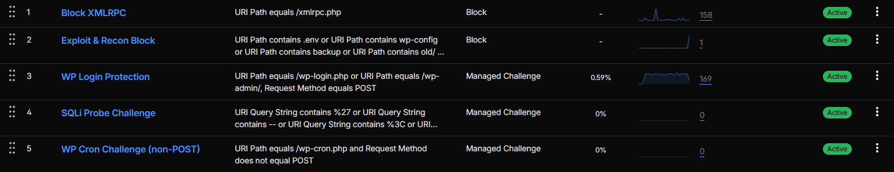

# Cloudflare WP Shield (Free Plan)

A practical, **Cloudflare Free plan–compatible** ruleset for protecting WordPress sites against common noise and attacks:

- XML-RPC abuse
- `/wp-login.php` brute force
- exploit/recon scans (e.g., `.env`, installers, backups, random `*.php` probing)
- basic SQLi probing in query strings
- `/wp-cron.php` abuse (non-POST)

> ✅ No regex required (Cloudflare Free plan friendly).  
> ✅ Designed to fit the **5/5 Custom Rules** limit.

---

## Quick start (Cloudflare UI)

Cloudflare Dashboard → **Security** → **WAF** → **Custom rules**

Create rules in this order:

1. **Block XMLRPC** *(Block)*
2. **Exploit & Recon Block** *(Block)*
3. **WP Login Protection** *(Managed Challenge)*
4. **SQLi Probe Challenge** *(Managed Challenge)*
5. **WP Cron Challenge (non-POST)** *(Managed Challenge)*

Copy/paste expressions from: **[`rules/ruleset-free-plan.md`](rules/ruleset-free-plan.md)**

---

## Notes

### `/wp-admin/` in the login rule
Most login brute force focuses on `/wp-login.php` **POST** requests.  
This repo’s default ruleset challenges login **POST** only. If you want to include `/wp-admin/` as well, see the optional variant noted in the ruleset file.

### False positives
If your site uses custom PHP endpoints in the root (e.g., `/api.php`), the recon rule may block them. Add a whitelist exception (see: `docs/troubleshooting.md`).

---

## Files

- **Rules (per-rule docs):** `rules/01-...` to `rules/05-...`
- **All-in-one ruleset:** `rules/ruleset-free-plan.md`
- **UI steps:** `docs/cloudflare-ui-steps.md`
- **Troubleshooting / whitelisting:** `docs/troubleshooting.md`

---

---

## Non-WordPress / Corporate / API (Free Plan)

If you're protecting a non-WordPress application (corporate site, Laravel, Node.js API, custom backend),
use the dedicated 3-rule ruleset:

See: `rules/ruleset-non-wordpress-api.md`

Recommended order:

1) Exploit & Recon Block (Block)  
2) Hidden File Block (Block)  
3) SQLi Probe Challenge (Managed Challenge)

Optional: add Rate Limiting for `/api/` endpoints via Cloudflare UI.

## License

MIT © 2026 BigDesigner (see `LICENSE`).
